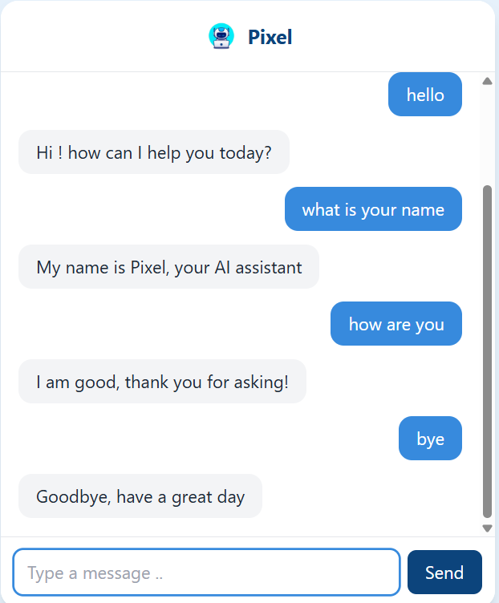

# Pixel Chatbot (Work In Progress) 🤖

This is a simple chatbot UI and logic prototype I am currently developing. It's a "Work in Progress" project aimed at practicing frontend integration with basic interaction logic.

## 🚧 Project Status: Under Development
The project is in its early stages. Currently, it uses a predefined set of responses to demonstrate the interface functionality.

## ✨ Current Features
* **Basic UI:** A clean chat interface built with **Tailwind CSS**.
* **Simple Logic:** Functional message sending/receiving using **Vanilla JavaScript**.
* **Responsiveness:** Works on different screen sizes.

## 🛠️ Built With
* HTML
* Tailwind CSS
* JavaScript (DOM Manipulation)

## 📅 What's Next?
* Improving the response logic.
* Refining the UI design.
* Exploring ways to make the bot smarter.

## 📸 Screenshot
